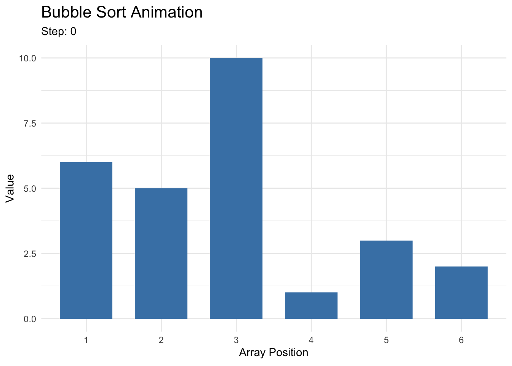

### Bubble Sort

As a proof-of-concept, we choose to use bubble sort as a starting point for sorting.\
The **bubble sort**[^bubble-1] function passes through a given vector, performing $O(n^2)$ repeated pairwise element comparisons to finish the sort.\
It has the benefit of having local operations, mostly comparisons and swaps, without more advanced logic such as dynamic memory allocation (that e.g. quicksort would need), so it is a good candidate for FHE prototyping despite being a well-known "slow" sorting algorithm.

[^bubble-1]: **Bubble sort** available from https://en.wikipedia.org/wiki/Bubble_sort

Given an $n$-length vector $x$, the following move will return an $n$-length vector $y$ that is equal to $x$ in every coordinate except possibly $x_i$ and $x_j$.\
We call one pass of this function over a vector as a "bubble," $\mathtt{bub_{i,j}(x)}$:

> Compare $x_i, x_j$ (typically, $i+1 = j$).\
> (1) If $x_i < x_j$, then $y = x$ with no swapping performed.\
> (2) If $x_i > x_j$, then $y$ has $x_i$ and $x_j$ swapped.

```{r}
#| echo: false
#| warning: false
#| message: false
#| fig-align: center
#| fig-alt: "A gif animation of a simple bubble sort being done on 6 bar barplot"

library(ggplot2)
library(gganimate)
library(dplyr)

set.seed(203)
# Set an initial vector with 6 bars
initial_vector <- sample(1:10, 6)

# Set bubble sort as a function
bubble <- function(arr) {
  n <- length(arr)
  swap <- TRUE
  
  # FIX: Change 'step_count' to 'step' so it matches the rest of your code
  step <- 0 
  
  # Set up a dataframe that holds all previous images together
  history <- data.frame()
  
  # Start from step 0 and initialize it
  history <- rbind(history, data.frame(
    Step = step,
    Index = 1:n,
    Value = arr,
    Status = "Normal"
  ))
  
  # While the swap is true, keep incrementing
  while (swap) {
    swap <- FALSE
    
    for (i in 1:(n - 1)) {
      step <- step + 1
      
      # Generate image during comparison
      frame_data <- data.frame(
        Step = step,
        Index = 1:n,
        Value = arr,
        Status = ifelse(1:n %in% c(i, i + 1), "Comparing", "Normal")
      )
      # Save it to history
      history <- rbind(history, frame_data)
      
      # If we detect a swap
      if (arr[i] > arr[i + 1]) {
        # Swap the elements
        temp <- arr[i]
        arr[i] <- arr[i + 1]
        arr[i + 1] <- temp
        swap <- TRUE
      }
    }
  }
  
  # Check the finished state
  step <- step + 1
  history <- rbind(history, data.frame(
    Step = step,
    Index = 1:n,
    Value = arr,
    Status = "Finished"
  ))
  
  return(history)
}

# Run the history tracker
sorting_data <- bubble(initial_vector)

# 3. Create the ggplot object
p <- ggplot(sorting_data, aes(x = factor(Index), y = Value, fill = Status)) +
  geom_bar(stat = "identity", width = 0.7) +
  scale_fill_manual(values = c("Normal" = "steelblue", "Comparing" = "red", "Finished" = "forestgreen")) +
  labs(
    title = "Bubble Sort Animation",
    subtitle = "Step: {closest_state}",
    x = "Array Position", 
    y = "Value"
  ) +
  theme_minimal() +
  theme(legend.position = "none", plot.title = element_text(size = 16, face = "bold"))

# 4. Animate across the 'Step' variable
anim <- p + transition_states(Step, transition_length = 1, state_length = 2)

# 5. Render and save the file to your working directory
gif1 <- animate(anim, nframes = max(sorting_data$Step) * 2, fps = 3, renderer = gifski_renderer("sorting_visualizer.gif"))



```

To perform the pairwise comparisons in a non-logical-branching FHE setting, we can use a polynomial-approximated sign function.\
Recall that we can implement a sign function $\mathtt{sign}(x)$ that returns $1$ if $x \geq 0$ and $0$ otherwise.\
As a proof of concept, define $s=\mathtt{sign}(x_i-x_j)$ and consider: $$
\begin{aligned}
y_i &= s \cdot x_j + (1-s) \cdot x_i \\
y_j &= s \cdot x_i + (1-s) \cdot x_j.
\end{aligned} $$ We can see that this would give $y_i$ the smaller value between $\{x_i, x_j\}$ and $y_j$ the larger value.

It's a bit tricky to actually implement this with vector-wide operations without being wasteful.\
Here is one draft:

1.  Construct constant $1$-hot vectors $c_1 = (1, \ldots, 0, 0, 0)$, $c_2 = (0, 1, 0, \ldots)$, ... Let $x = (x_1, \ldots, x_{n/2})$.
2.  For a given $i, j$, compute $$m' = (c_i - c_j) * (x_i, x_i, \ldots, x_i) + (c_j - c_i) * (x_j, x_j, \ldots, x_j).$$ This will have a $0$ everywhere, except $m'_i = x_i - x_j$ and $m'_j = x_j - x_i.$
3.  Now multiply $m = (c_i - c_j) * m'$. This will also have a $0$ everywhere, except $m_i = m_j = x_i - x_j$.
4.  Let $s = -\mathtt{sign}(-m)*m'$. Here,
    -   $s_i$ will be $x_j - x_i$ if $x_j > x_i$, 0 otherwise.
    -   $s_j$ will be $x_i - x_j$ if $x_j > x_i$, 0 otherwise.
    -   all other elements are 0.
5.  Compute $y = x + s$. If $x_j < x_i$ then $s_k = 0$ everywhere, so $y = x$. If $x_j > x_i$ then $y_i = x_i + (x_j - x_i) = x_j$, and $y_j = x_j + (x_i-x_j) = x_i$. In other words, the result flips $x_j$ and $x_i$ if $x_j > x_i$, meaning the larger element goes to $x_i$ and the lower element goes to $x_j$.

We can then define $\mathtt{bub_{i,j}}(x)$ to be the operation that changes $x$ to the resulting $y$.
Note this is fully FHE legal and involves no branching.

1.  Perform $\mathtt{bub_{{n/2-1},n/2}}(x)$, ..., $\mathtt{bub_{1,2}}(x)$. These $n-1$ moves ensure the maximum element is now at $x_1$.
2.  Perform $\mathtt{bub_{{n/2-1},n/2}}(x)$, ..., $\mathtt{bub_{2,3}}(x)$. These $n-2$ moves ensure the second-largest element is now at $x_2$.
3.  ...

$O(n^2)$ total comparisons (with $O(n)$ per pass) will entirely sort $x$.
However, this gets fairly costly and noisy due to the multiplications in the approximated comparisons.
